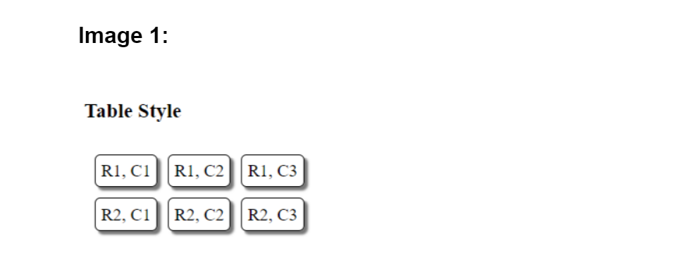
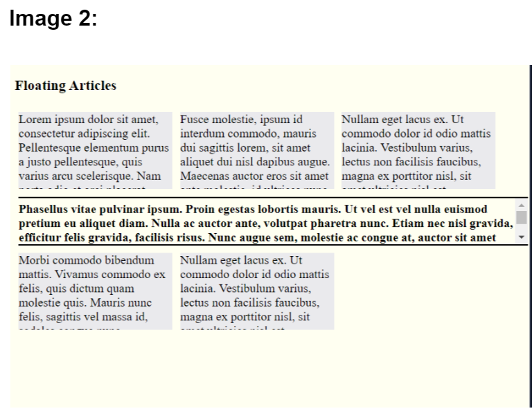
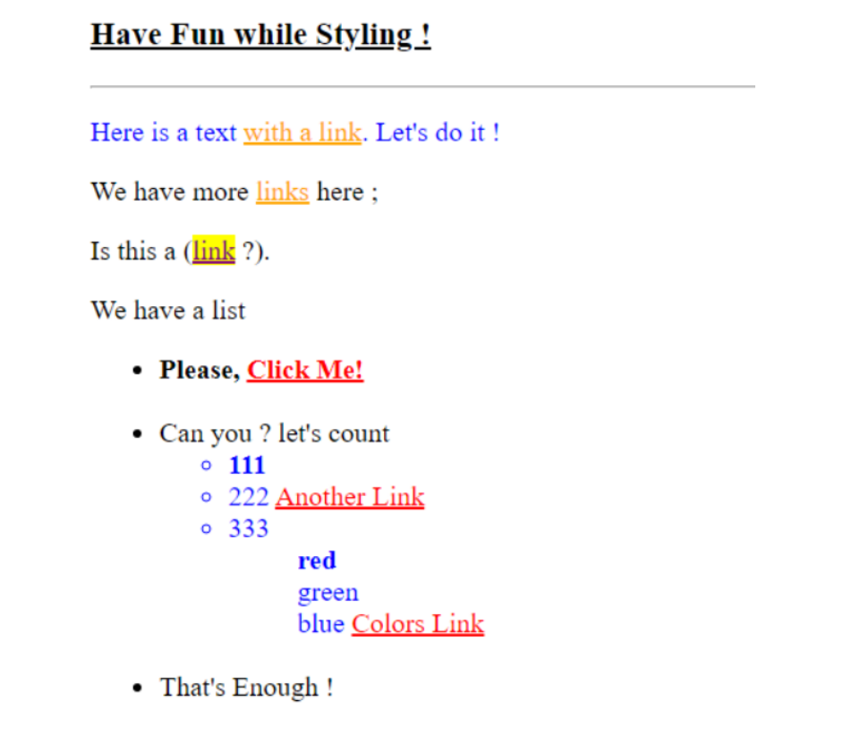

# CSS-practice
> ### `Introduction:`
The three images below have been converted to HTML files and formatted using CSS.
---

> ### `Used Tools:`
+ VS code.
+ ImageColorPiker Website.
---
> ### `Used Languages:`
+ HTML
+ CSS
---
> ### `ScreenShots:`

+ 
+ 
+ 
---
> ### `task2:`
conver image to html and css file using position,nth-child.
